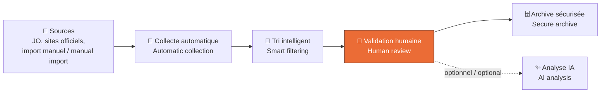
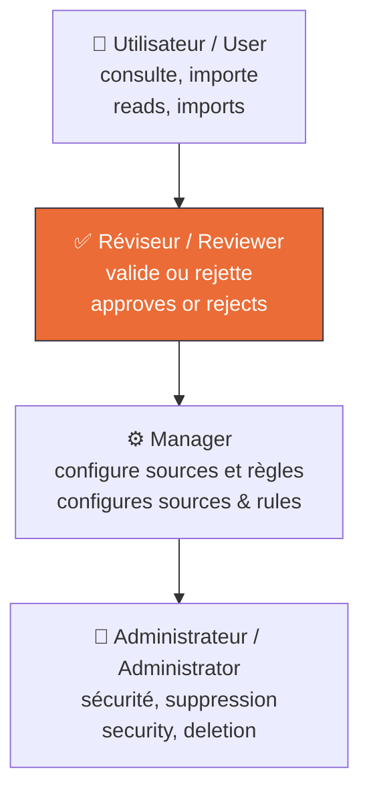
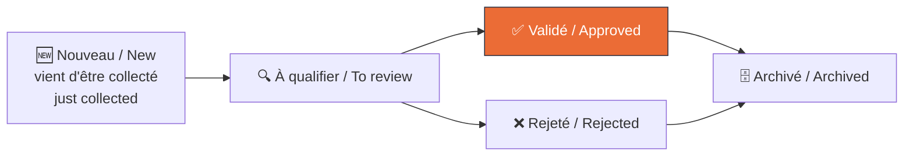
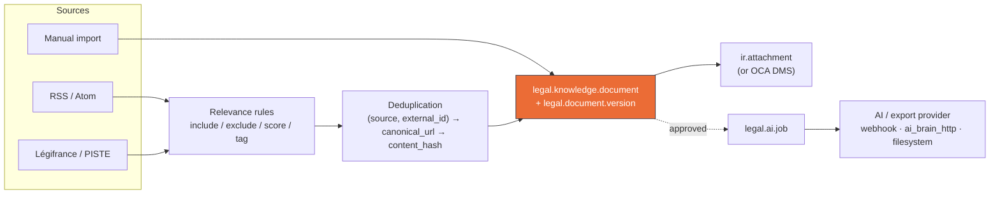
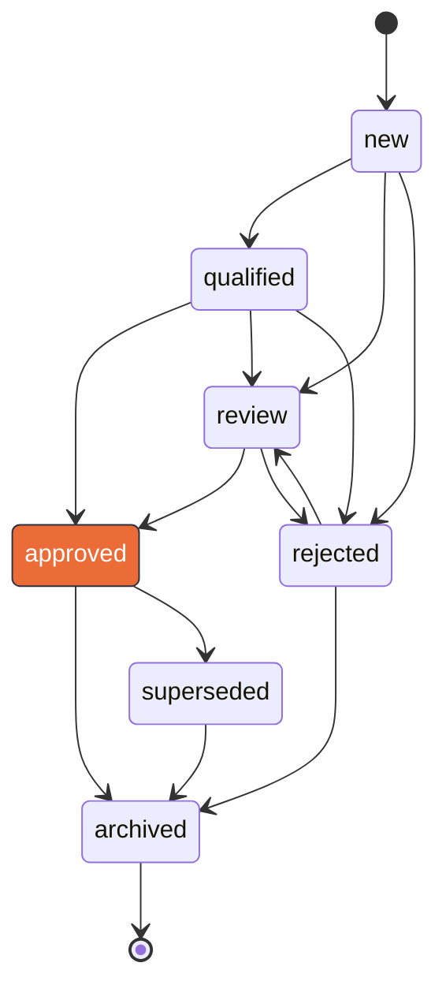

# Legal Knowledge Watch

[](https://github.com/Najah69/Odoo-Veille-Juridique/actions/workflows/tests.yml)

Odoo 18 Community module to collect, normalize, deduplicate and archive legal
and regulatory content from trusted sources, with a human review workflow and
a locally-owned document history.

*Module Odoo 18 Community pour collecter, normaliser, dédupliquer et
archiver du contenu juridique et réglementaire depuis des sources fiables,
avec un circuit de validation humaine et un historique des documents
hébergé chez vous.*

> **This is a documentation and monitoring tool. It does not provide legal,
> tax or accounting advice, and it does not replace consultation with a
> qualified lawyer, accountant or other professional.**
>
> **Ceci est un outil de documentation et de veille. Il ne fournit aucun
> conseil juridique, fiscal ou comptable, et ne remplace pas la
> consultation d'un avocat, d'un expert-comptable ou d'un autre
> professionnel qualifié.**

## À quoi sert ce module ? / What is this module for?

*Cette section s'adresse à un lecteur non technicien. Pour la
documentation technique, voir les sections suivantes.*
*This section is written for a non-technical reader. For the technical
documentation, see the sections below.*

### 🇫🇷 En clair

Ce module surveille pour vous les textes juridiques et réglementaires qui
vous concernent (lois, décrets, arrêtés, circulaires...), qu'ils viennent
de Légifrance, d'un flux RSS officiel, ou d'un document que vous importez
vous-même. Il **collecte** ces textes, les **trie** automatiquement selon
des règles que vous définissez (mots-clés, source, thème), puis **attend
votre validation humaine** avant de les considérer comme fiables. Rien
n'est jamais décidé tout seul par une intelligence artificielle — l'IA
(optionnelle) peut résumer ou classer un texte, mais c'est toujours une
personne qui valide, approuve ou rejette.

Une fois validé, chaque texte est **archivé durablement** dans votre
système Odoo, avec tout son historique (versions précédentes, qui l'a
validé, quand) — vous n'êtes jamais dépendant d'un service extérieur pour
retrouver ce que vous avez déjà validé.

### 🇬🇧 In plain terms

This module watches legal and regulatory texts that matter to you (laws,
decrees, orders, circulars...) on your behalf — whether they come from
Légifrance, an official RSS feed, or a document you import yourself. It
**collects** these texts, automatically **sorts** them using rules you
define (keywords, source, topic), then **waits for a human to validate**
them before treating them as trustworthy. Nothing is ever decided by an
AI alone — an optional AI can summarize or classify a text, but a person
always approves or rejects it.

Once validated, every text is **durably archived** inside your own Odoo
system, with its full history (previous versions, who validated it, and
when) — you are never dependent on an external service to find something
you've already validated.

### Le principe en un coup d'œil / The big picture



### Qui fait quoi ? / Who does what?



### Le parcours d'un document / A document's journey



### Ce que ce module n'est PAS / What this module is NOT

- ❌ Ce n'est **pas** un conseiller juridique — il ne vous dit jamais quoi
  faire, il vous aide à ne rien manquer.
  <br>❌ It is **not** a legal advisor — it never tells you what to do,
  it helps you not miss anything.
- ❌ Il ne publie ni ne transmet automatiquement un texte sans validation
  humaine — l'export vers un outil d'IA/RAG est optionnel et toujours
  soumis à une politique que vous configurez.
  <br>❌ It never publishes or forwards a text automatically without human
  validation — export to an AI/RAG tool is optional and always gated by a
  policy you configure.
- ❌ Ce n'est pas un service en ligne (SaaS) — tout tourne dans votre
  propre installation Odoo, vos données restent chez vous.
  <br>❌ It is not a SaaS — everything runs inside your own Odoo instance,
  your data stays with you.

## Status: Phase 6 (security audit & release candidate)
## Statut : Phase 6 (audit sécurité & release candidate)

- Manual import (file upload or pasted text).
  <br>Import manuel (fichier téléversé ou texte collé).
- **RSS/Atom connector**: conditional GET (ETag/Last-Modified), bounded
  retries, domain whitelist, never scrapes a linked article by default.
  <br>**Connecteur RSS/Atom** : GET conditionnel (ETag/Last-Modified),
  tentatives bornées, liste blanche de domaines, ne scrape jamais un
  article lié par défaut.
- **Légifrance/PISTE connector** (LODA collection: lois, ordonnances,
  décrets, arrêtés) — OAuth2 Client Credentials, keyword+date+nature
  search, full-text retrieval. See `docs/legifrance-piste.md` for exactly
  what was verified against real sources (no PISTE account was available
  to test this live) vs. what still needs checking against a live sandbox.
  <br>**Connecteur Légifrance/PISTE** (collection LODA : lois,
  ordonnances, décrets, arrêtés) — OAuth2 Client Credentials, recherche
  par mot-clé + date + nature, récupération du texte intégral. Voir
  `docs/legifrance-piste.md` pour le détail exact de ce qui a été vérifié
  contre de vraies sources (aucun compte PISTE disponible pour un test en
  conditions réelles) vs. ce qui reste à vérifier sur un vrai sandbox.
- **Deterministic relevance rules** (keyword/regex/source-field →
  include/exclude/score/tag/requires_review), evaluated before ingestion.
  <br>**Règles de pertinence déterministes** (mot-clé/regex/champ-source
  → include/exclude/score/tag/requires_review), évaluées avant
  l'ingestion.
- Scheduled fetch cron with a PostgreSQL-row-lock guard against concurrent
  runs of the same watch (see `docs/connectors.md`).
  <br>Cron de récupération planifié avec un verrou PostgreSQL par ligne
  contre les exécutions concurrentes d'une même veille (voir
  `docs/connectors.md`).
- **Optional OCA DMS storage backend**, selectable per watch/import
  (`auto`/`dms`/`attachment`) — never a hard dependency; see
  `docs/oca-dms-integration.md`.
  <br>**Backend de stockage OCA DMS optionnel**, sélectionnable par
  veille/import (`auto`/`dms`/`attachment`) — jamais une dépendance dure ;
  voir `docs/oca-dms-integration.md`.
- **Agnostic AI/export provider layer** (`legal.ai.provider`/`legal.ai.job`/
  `legal.document.enrichment`): `webhook`, `ai_brain_http` (this project's
  own documented HTTP contract) and a network-free `filesystem` (JSONL)
  provider. AI never overrides a human decision — classification only ever
  sets a "needs review" flag, and export is gated by a configurable,
  fail-closed policy re-checked fresh on every job attempt. See
  `docs/ai-providers.md`.
  <br>**Couche agnostique de providers IA/export**
  (`legal.ai.provider`/`legal.ai.job`/`legal.document.enrichment`) :
  `webhook`, `ai_brain_http` (contrat HTTP propre à ce projet, documenté)
  et un provider `filesystem` (JSONL) sans réseau. L'IA ne remplace
  jamais une décision humaine — la classification ne fait jamais que
  poser un indicateur « à revoir », et l'export est verrouillé par une
  politique configurable, fail-closed, revérifiée à chaque tentative de
  job. Voir `docs/ai-providers.md`.
- **Configurable export policies** (`legal.export.policy`, per
  company/source/watch) and a **reconciliation cron** that detects and
  repairs drift (missing exports, superseded-but-still-exported documents,
  stuck jobs/runs) without ever deleting local history — Odoo remains the
  durable registry, any export index is a reconstructible projection.
  <br>**Politiques d'export configurables** (`legal.export.policy`, par
  société/source/veille) et un **cron de réconciliation** qui détecte et
  corrige les dérives (exports manquants, documents remplacés mais
  toujours exportés, jobs/runs bloqués) sans jamais supprimer
  l'historique local — Odoo reste le registre durable, tout index d'export
  n'est qu'une projection reconstructible.
- **Retention** (`legal.retention.policy`): archive old rejected documents
  (reversible), then — only after a separate explicit grace period —
  purge just the binary content of non-current (superseded) versions on
  already-archived documents. The current version and every metadata row
  are never touched. Dry-run by default; a real run is always a
  deliberate action. See `docs/operations.md`.
  <br>**Rétention** (`legal.retention.policy`) : archive les anciens
  documents rejetés (réversible), puis — seulement après un délai de
  grâce explicite et distinct — purge uniquement le contenu binaire des
  versions non courantes (remplacées) sur des documents déjà archivés. La
  version courante et chaque ligne de métadonnées ne sont jamais
  touchées. Simulation par défaut ; une exécution réelle est toujours une
  action délibérée. Voir `docs/operations.md`.
- Normalization, SHA-256 content hashing, deduplication, version history.
  <br>Normalisation, hachage de contenu SHA-256, déduplication,
  historique des versions.
- Document review workflow (`new → qualified → review → approved/rejected →
  archived/superseded`).
  <br>Circuit de revue documentaire (`new → qualified → review →
  approved/rejected → archived/superseded`).
- Multi-company record rules and role-based access control.
  <br>Règles d'enregistrement multi-société et contrôle d'accès par rôle.
- **Security-hardening pass**: closed a cross-company data-exposure gap on
  `legal.ai.job`/`legal.document.enrichment`/3 other config models,
  restricted `legal.document.version` writes to the sanctioned creation
  path only, and added SSRF/redirect/response-size protection to every
  outbound call to an admin-configured URL. See `docs/security.md` for the
  full audit, including what remains a documented residual risk.
  <br>**Passe de durcissement sécurité** : fermeture d'une fuite de
  données inter-société sur `legal.ai.job`/`legal.document.enrichment`/3
  autres modèles de config, écriture sur `legal.document.version`
  restreinte au seul chemin de création sanctionné, et ajout d'une
  protection SSRF/redirection/taille de réponse sur tout appel sortant
  vers une URL configurée par un admin. Voir `docs/security.md` pour
  l'audit complet, y compris ce qui reste un risque résiduel documenté.

See `CHANGELOG.md` for exactly what is implemented today.
Voir `CHANGELOG.md` pour le détail exact de ce qui est implémenté
aujourd'hui.

## Compatibility / Compatibilité

- Odoo 18.0 Community.
- Python 3.12.
- Dependencies: `base`, `mail` (core Odoo only). External Python packages:
  `requests`, `feedparser`, `bs4` (beautifulsoup4) — declared in the
  manifest's `external_dependencies`, so the module refuses to install if
  any is missing. `PyPDF2` is used opportunistically for PDF text
  extraction in the manual-import wizard if it is installed — if it is not,
  the original PDF is still kept as an attachment and the document is
  flagged for human review instead of failing the import.
  <br>Dépendances : `base`, `mail` (cœur Odoo uniquement). Paquets Python
  externes : `requests`, `feedparser`, `bs4` (beautifulsoup4) — déclarés
  dans `external_dependencies` du manifest, donc le module refuse de
  s'installer si l'un manque. `PyPDF2` est utilisé de façon opportuniste
  pour l'extraction de texte PDF dans l'assistant d'import manuel s'il est
  installé — sinon, le PDF original reste conservé en pièce jointe et le
  document est marqué pour revue humaine plutôt que de faire échouer
  l'import.

## Installation

1. Copy `legal_knowledge_watch/` into your Odoo addons path.
   <br>Copiez `legal_knowledge_watch/` dans votre chemin d'addons Odoo.
2. Install the required Python packages in the Odoo environment if not
   already present: `pip install requests feedparser beautifulsoup4`.
   <br>Installez les paquets Python requis dans l'environnement Odoo s'ils
   ne sont pas déjà présents : `pip install requests feedparser
   beautifulsoup4`.
3. Update the apps list and install **Legal Knowledge Watch**.
   <br>Mettez à jour la liste des applications et installez **Legal
   Knowledge Watch**.

No OCA module is required. A Légifrance/PISTE watch needs PISTE
credentials (see `docs/legifrance-piste.md`); every other feature works
with zero external accounts.

Aucun module OCA n'est requis. Une veille Légifrance/PISTE a besoin
d'identifiants PISTE (voir `docs/legifrance-piste.md`) ; toute autre
fonctionnalité marche sans aucun compte externe.

## Quick start / Démarrage rapide

1. **Configuration → Sources**: create at least one `legal.source` (name,
   code, authority type, trust level).
   <br>**Configuration → Sources** : créez au moins une `legal.source`
   (nom, code, type d'autorité, niveau de confiance).
2. **Manual Import**: choose "Upload a file" (.txt, .md, .html, .htm, .pdf)
   or "Paste text", fill in the source and metadata, and import.
   <br>**Import manuel** : choisissez « Téléverser un fichier » (.txt,
   .md, .html, .htm, .pdf) ou « Coller du texte », renseignez la source
   et les métadonnées, puis importez.
3. The resulting **Document** is created (or a new version is added to an
   existing one if the same source/external ID/URL already exists with
   different content). Re-importing identical content is a no-op.
   <br>Le **Document** résultant est créé (ou une nouvelle version est
   ajoutée à un document existant si la même source/ID externe/URL existe
   déjà avec un contenu différent). Réimporter un contenu identique ne
   fait rien (no-op).
4. Move the document through the review workflow from its status bar
   (`Reviewer` role or above).
   <br>Faites avancer le document dans le circuit de revue depuis sa
   barre de statut (rôle `Reviewer` ou supérieur).

For an RSS watch instead, see `docs/operations.md` ("Adding a new RSS watch
— minimal example") and the connector/rule contract in `docs/connectors.md`.
For a Légifrance/PISTE watch, see `docs/legifrance-piste.md`. To store
content in OCA DMS instead of `ir.attachment`, see
`docs/oca-dms-integration.md`. To classify documents with AI or export
approved ones to a RAG/vector-store service, see `docs/ai-providers.md`.

Pour une veille RSS, voir `docs/operations.md` (« Adding a new RSS watch —
minimal example ») et le contrat connecteur/règle dans
`docs/connectors.md`. Pour une veille Légifrance/PISTE, voir
`docs/legifrance-piste.md`. Pour stocker le contenu dans OCA DMS plutôt
que dans `ir.attachment`, voir `docs/oca-dms-integration.md`. Pour
classifier des documents avec l'IA ou exporter les documents validés vers
un service RAG/vector-store, voir `docs/ai-providers.md`.

## Architecture in one paragraph / L'architecture en un paragraphe

`legal.knowledge.document` is the business source of truth: it never mixes
raw source content with any later analysis, and it never hard-couples to a
storage technology. Content itself lives in `legal.document.version`
records, each pointing to wherever it was actually stored — an
`ir.attachment` by default, or a `dms.file` if OCA DMS is installed and
selected — so the full history of a document is kept even when it changes
or the storage backend changes. Deduplication is checked in this order:
`(source, external_id)`, then canonical URL within the same source, then
content hash globally — this is what makes re-importing the same content a
safe, idempotent no-op instead of creating clutter.

`legal.knowledge.document` est la source de vérité métier : il ne mélange
jamais le contenu source brut avec une analyse ultérieure, et ne se lie
jamais en dur à une technologie de stockage. Le contenu lui-même vit dans
des enregistrements `legal.document.version`, chacun pointant vers
l'endroit où il a réellement été stocké — un `ir.attachment` par défaut,
ou un `dms.file` si OCA DMS est installé et sélectionné — de sorte que
l'historique complet d'un document est conservé même quand il change ou
que le backend de stockage change. La déduplication est vérifiée dans cet
ordre : `(source, external_id)`, puis l'URL canonique au sein de la même
source, puis le hachage de contenu globalement — c'est ce qui rend la
réimportation d'un même contenu sûre, idempotente, et sans effet
(no-op), plutôt que de créer des doublons inutiles.

Full data model, document lifecycle and ingestion pipeline:
`docs/architecture.md`. Contributing a change: `CONTRIBUTING.md`.

Modèle de données complet, cycle de vie des documents et pipeline
d'ingestion : `docs/architecture.md`. Contribuer à ce projet :
`CONTRIBUTING.md`.

### Ingestion pipeline

One accent color marks the single durable record everything else revolves
around — every other node is deliberately unstyled so it reads correctly
in both GitHub's light and dark themes.



### Document lifecycle

Mirrors `_ALLOWED_TRANSITIONS` in `models/legal_knowledge_document.py`
exactly — this diagram and that dict must never drift apart.



<sub>Diagram palette (one accent, restrained default styling) follows the
principles in [cathrynlavery/diagram-design](https://github.com/cathrynlavery/diagram-design).</sub>

## Security & data / Sécurité et données

- Manual import, RSS and OCA DMS need no secrets at all. Légifrance/PISTE
  and any AI/export provider using bearer or header auth need a token,
  read via environment variables (preferred) or system parameters — never
  committed, never displayed in the UI, never logged. See
  `docs/legifrance-piste.md` and `docs/ai-providers.md`.
  <br>L'import manuel, RSS et OCA DMS ne nécessitent aucun secret.
  Légifrance/PISTE et tout provider IA/export utilisant une authentification
  bearer ou header ont besoin d'un jeton, lu via des variables
  d'environnement (préféré) ou des paramètres système — jamais committé,
  jamais affiché dans l'UI, jamais journalisé. Voir
  `docs/legifrance-piste.md` et `docs/ai-providers.md`.
- Access is controlled by four groups (`User`, `Reviewer`, `Manager`,
  `Administrator`), company-scoped record rules on every model that
  carries a `company_id`, and a restricted write path on
  `legal.document.version` (see `docs/security.md`).
  <br>L'accès est contrôlé par quatre groupes (`User`, `Reviewer`,
  `Manager`, `Administrator`), des règles d'enregistrement cloisonnées par
  société sur chaque modèle portant un `company_id`, et un chemin
  d'écriture restreint sur `legal.document.version` (voir
  `docs/security.md`).
- Document deletion (`unlink`) is restricted to `Administrator`; use
  **Archive** for normal end-of-life instead, so the audit trail (chatter,
  version history) is preserved.
  <br>La suppression de document (`unlink`) est réservée à
  `Administrator` ; utilisez **Archiver** pour une fin de vie normale, afin
  que la piste d'audit (chatter, historique des versions) soit préservée.
- Every outbound call to an admin-configured URL (RSS `feed_url`, AI
  provider `base_url`) is checked against literal private/loopback/
  link-local addresses, never follows a redirect, and is capped at 5 MB.
  See `docs/security.md` for exactly what this does and does not cover
  (hostname-based SSRF via DNS is a documented residual gap, not silently
  ignored).
  <br>Tout appel sortant vers une URL configurée par un admin (`feed_url`
  RSS, `base_url` d'un provider IA) est vérifié contre les adresses
  privées/loopback/link-local littérales, ne suit jamais de redirection,
  et est plafonné à 5 Mo. Voir `docs/security.md` pour le détail exact de
  ce que cela couvre ou non (le SSRF par nom d'hôte via DNS est une
  lacune résiduelle documentée, jamais passée sous silence).

Full audit, threat model and residual risks: `docs/security.md`.
Audit complet, modèle de menace et risques résiduels : `docs/security.md`.

## Running the tests / Lancer les tests

From an Odoo 18 environment with this module on the addons path:
Depuis un environnement Odoo 18 avec ce module sur le chemin d'addons :

```bash
odoo --test-enable --stop-after-init -i legal_knowledge_watch -d <test_db>
```

All tests run offline: every RSS/Légifrance/AI-provider test mocks the
`requests` calls (including the OAuth token request) — the suite never
makes a real HTTP call.

Tous les tests s'exécutent hors ligne : chaque test RSS/Légifrance/provider
IA simule (mock) les appels `requests` (y compris la requête de jeton
OAuth) — la suite ne fait jamais un vrai appel HTTP.

## License / Licence

AGPL-3.0-or-later. See `LICENSE`.
AGPL-3.0-or-later. Voir `LICENSE`.
